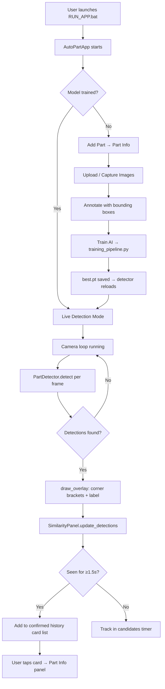

# AutoPartDetector — Full Project Analysis

> **Project:** AutoPartDetector v14 (Final)
> **Location:** `f:\A_Jeshwa\C1_AutoPartDetector files\AutoPartDetector_v14_final\AutoPartDetector`
> **Purpose:** AI-Powered Industrial Automobile Part Identification & Management System

---

## 1. Project Overview

**AutoPartDetector** is a fully offline, CPU-optimized, standalone desktop application designed for **industrial production-line part identification**. It uses a custom-trained **YOLOv8 deep learning model** to detect automobile parts in real time via a webcam, and matches each detected part against a **SQLite database** of registered parts — surfacing part numbers, supplier info, model codes, and quality judgements instantly.

The system is **tablet-first**: the interface is designed for 10–13" touchscreen tablets commonly found on factory floors, with large buttons (≥48px), an on-screen virtual keyboard, and swipe-to-scroll support across all panels.

The entire workflow — from adding parts, capturing training images, annotating bounding boxes, training the AI, to live detection — is handled in a single unified GUI with no dependency on the internet after initial setup.

---

## 2. Technology Stack

| Layer | Technology | Version / Notes |
|---|---|---|
| **Language** | Python | 3.9 – 3.11 |
| **GUI Framework** | Tkinter (+ ttk) | Built into Python stdlib |
| **AI / Detection** | Ultralytics YOLOv8 | `ultralytics==8.2.18` |
| **Deep Learning Backend** | PyTorch (CPU-only) | `--index-url https://download.pytorch.org/whl/cpu` |
| **Fast Inference (Intel)** | Intel OpenVINO | `openvino>=2024.1.0` |
| **ONNX Inference** | ONNX Runtime | `onnxruntime>=1.18.0` |
| **Computer Vision** | OpenCV | `opencv-python>=4.9.0` |
| **Image Processing** | Pillow | `Pillow>=10.3.0` |
| **Database** | SQLite 3 | Via Python `sqlite3` stdlib |
| **Data Processing** | NumPy | `numpy>=1.26.0` |
| **Config Parsing** | PyYAML | `PyYAML>=6.0.1` |
| **Packaging** | PyInstaller | Via `AutoPartDetector.spec` |
| **Target Hardware** | Intel i5 + Intel UHD | No NVIDIA GPU required |
| **OS** | Windows 10 / 11 | |

---

## 3. Project Directory Structure

```
AutoPartDetector/
│
├── main.py                      ← Entry point (delegates to gui/app.py)
├── RUN_APP.bat                  ← One-click launcher (checks + installs deps, then runs)
├── install_cpu.bat              ← Manual one-time dependency installer
├── build_exe.bat / build_exe.sh ← Build standalone Windows .exe
├── AutoPartDetector.spec        ← PyInstaller config
├── requirements.txt             ← CPU-focused package list
├── offline_setup.py             ← Sets up offline environment
├── README.md                    ← User guide + accuracy tips
│
├── gui/
│   ├── __init__.py
│   └── app.py                   ← Main GUI (1910 lines) — ALL screens live here
│
├── detection/
│   ├── __init__.py
│   └── detector.py              ← YOLOv8 inference engine + visual overlay renderer
│
├── database/
│   ├── __init__.py
│   ├── db_manager.py            ← All SQLite CRUD (parts, images, history)
│   ├── parts.db                 ← SQLite database file
│   └── visual_cache.json        ← Cached visual feature vectors
│
├── training_pipeline.py         ← YOLOv8 training + augmentation + export
├── similarity_engine.py         ← Visual similarity comparison (feature extraction)
├── tablet_utils.py              ← Virtual keyboard, touch scroll, mousewheel
│
├── dataset/
│   ├── images/train/ & val/     ← Auto-populated at train time
│   ├── labels/train/ & val/     ← Auto-populated at train time
│   ├── labels_raw/              ← Raw YOLO .txt annotation files
│   └── dataset.yaml             ← Generated YAML config for YOLOv8 training
│
├── trained_model/
│   ├── best.pt                  ← Primary PyTorch model (used for inference)
│   ├── best.onnx                ← ONNX export (faster on CPU)
│   ├── best_openvino/           ← OpenVINO export (fastest on Intel)
│   └── pretrained/              ← Offline base weights (yolov8s.pt etc.)
│
├── parts_images/                ← All uploaded/captured part photos
├── screenshots/                 ← Live detection screenshots
├── training_logs/               ← JSON logs of each training run (metrics)
├── history/                     ← (Reserved for future session history export)
├── runs/                        ← YOLOv8 training output runs
├── .ultralytics_cfg/            ← Redirected Ultralytics config (prevents stale drive errors)
├── yolov8n.pt                   ← Bundled base YOLOv8 nano weights (6.5 MB)
└── assets/                      ← App icon + UI assets
```

---

## 4. Module-by-Module Breakdown

### 4.1 `main.py` — Entry Point
A minimal 15-line file. Adds the project root to `sys.path` and calls `gui.app.main()`. All real logic lives in the other modules.

---

### 4.2 `gui/app.py` — The Full GUI (1910 lines)
The largest and most complex file. Built entirely in **Tkinter**. Contains these major screen classes:

#### `AutoPartApp` (App Shell)
- Root `tk.Tk` window, 1366×768, maximized on startup.
- Persistent top bar: app title + live clock (updates every second).
- Navigation menu: **Home · Add Part · Database · History · Train AI**
- Screen management: single-panel routing (packs/unpacks screens without destroying the main detection screen).

#### `MainDetectionScreen` (Home Screen)
- **Left panel (~70% width):** Live camera feed rendered on a `tk.Canvas`.
  - Camera thread runs in background (`threading.Thread`, daemon).
  - Each frame is processed by `PartDetector.detect()`, overlay drawn with `draw_overlay()`, then displayed via `PIL.ImageTk.PhotoImage`.
  - Click on a bounding box → instantly loads full part info into right panel.
  - FPS counter + detected object count displayed live.
- **Right panel — Part Information:**
  - Shows: Part No, Part Name, Model, Supplier, Group, Date, Judgement, Reason, Zone, Quantity.
  - A photo of the part is loaded from the database and displayed proportionally.
  - Export to CSV button.
  - Screenshot capture button.
- **Right panel — Detected Parts (`SimilarityPanel`):**
  - Scrollable card list of all parts ever confirmed by camera in this session.
  - **1.5-second confirmation rule:** a part must be continuously visible for ≥1.5 s before it appears in the list — prevents transient false-positive noise.
  - Each card shows: LIVE/SEEN badge, part number, name, model, confidence bar.
  - Cards turn green-highlighted while the part is currently in frame.
  - Clicking a card instantly populates Part Information.
  - **Reset button** clears the entire session history.

#### `AddPartScreen` (Add / Edit Part)
Two-tab notebook:

**Tab 1 — Part Info:**
- Form fields: Part No, Part Name, Model, Supplier, YOLO Class, Group, Date.
- All fields have placeholder text + virtual keyboard auto-attach.
- `Save Part Info` → writes to SQLite via `db_manager.add_part()`.
- `Delete Part` → removes part + all linked images from DB.

**Tab 2 — Images & Annotate:**
- **Upload Images** — file picker, copies to `parts_images/`.
- **Camera Capture** — opens `CamCaptureWindow` to grab training photos.
- **Upload YOLO .txt** — Mode A: select image+txt pairs together; auto-matched by filename stem.
- **Upload ZIP** — Mode B: extract zip, auto-find image+label pairs.
- **Export All / Export One** — export images + YOLO labels to a chosen folder.
- **Train AI Model** — opens `TrainingWindow`.
- 3-column **image gallery** with per-image: thumbnail, annotation status badge, ✏️ Annotate / 🗑 Delete / 📤 Export buttons.
- Select All / Deselect All / Delete Selected bulk operations.

#### `AnnotatorWindow` (Bounding Box Annotator)
A full-screen annotation tool:
- Displays the image on a resizable canvas.
- **Draw mode:** left-drag on empty area → creates a new bounding box.
- **Move mode:** left-drag inside existing box → translates it.
- **Resize mode:** left-drag on any of 4 corner handles → resizes.
- **Delete:** right-click on a box.
- Right panel: YOLO class label, box count, listbox of all boxes, Delete Selected / Clear All buttons.
- **Save & Next** — writes YOLO `.txt` annotation, advances to next image in sequence automatically.
- Saves to `dataset/labels_raw/<filename>.txt` in normalized YOLO format: `class_id cx cy w h`.

#### `CamCaptureWindow`
- Opens webcam, streams preview.
- **Capture** button — saves timestamped photo to `parts_images/`, registers in DB.
- Guidance: "Capture 30+ photos — front, side, top, close-up, different lighting."

#### `TrainingWindow`
- Epoch count slider / entry (default 80).
- Image size selector (416 / 640).
- Model size selector (n/s/m).
- Progress bar + scrolling log output (threaded).
- Runs `training_pipeline.run_training()` in a background thread.
- Shows final grade (A/B/C/D based on mAP50) + advice.
- Triggers `PartDetector.reload()` after successful training.

#### `DatabaseScreen`
- Searchable `ttk.Treeview` table of all parts.
- Columns: Part No, Part Name, Model, YOLO Class, Judgement, Qty.
- Right panel: photo preview for selected part.
- Edit (double-click or button) → opens `AddPartScreen` pre-populated.
- Delete single or multi-select.
- Export all parts to CSV.

#### `HistoryScreen`
- `ttk.Treeview` of last 500 detection events.
- Columns: Timestamp, Part No, Part Name, Confidence %, Judgement.
- Clear All button.

#### `YoloUploadPanel`
A standalone frame (also accessible from Add Part) for bulk YOLO annotation import with Mode A (file pairs) and Mode B (ZIP), plus format reference guide.

---

### 4.3 `detection/detector.py` — Inference Engine

**`PartDetector` class:**
- On init: looks for `trained_model/best.pt`. If found, loads custom model. If not, sets `model_ready=False`.
- `reload()` — called after training to hot-swap the model without restarting the app.
- **Patches `torch.load`** to set `weights_only=False` (fixes PyTorch 2.6+ breaking change).
- **Redirects Ultralytics config** to `.ultralytics_cfg/` inside the project folder (prevents errors from stale drive letters).

**`detect(frame)`:**
- Calls `model.predict()` with `conf=0.50`, `iou=0.45`, `agnostic_nms=True`, `max_det=20`.
- Filters out boxes smaller than 1% or larger than 92% of the frame area (removes background noise and near-full-frame false positives).
- Returns list of `{label, confidence, bbox}` dicts.
- Tracks **EMA FPS** (exponential moving average, α=0.1) for a smooth display number.

**`draw_overlay(frame, detections, lookup_fn)`:**
- For each detection, calls `lookup_fn(label)` (= `get_part_by_yolo_class`) to fetch part metadata.
- Draws **L-shaped corner brackets** on all 4 corners of each bounding box (modern HUD-style look, not simple rectangles). Arm length scales with box size.
- Behind the brackets: draws a faint semi-transparent full rectangle (25% opacity blend via `cv2.addWeighted`).
- Draws a styled label tag above (or below if near top): two-line — part name + `PART_NO  CONF%`. Bold outline + white inner text (high contrast on any background).
- Uses 8-color palette cycling for multiple simultaneous detections.

---

### 4.4 `database/db_manager.py` — Data Layer

**SQLite schema — 3 tables:**

```sql
parts (
  id, part_no UNIQUE, part_name, model, supplier, group_name,
  date, zone, quantity, judgement, reason,
  image_path, yolo_class, created_at
)

part_images (
  id, part_no, image_path, label_path,
  annotated (0/1), source (upload/camera/yolo_import), created_at
)

detection_history (
  id, part_no, part_name, confidence,
  timestamp, screenshot_path, judgement
)
```

**Key operations:**
- `init_db()` — creates tables + seeds one demo part (`grab_handle` / Assist Grip Handle).
- `get_part_by_yolo_class(yolo_class)` — the critical lookup used during live detection.
- `get_all_annotated_images()` — JOIN query used by training pipeline to collect training data.
- `log_detection()` — called from camera loop (throttled to once per 10 seconds per part).
- Full CRUD for parts + images + history.

---

### 4.5 `training_pipeline.py` — AI Training

**`run_training(epochs, img_size, model_size, progress_cb, log_cb)`:**

Step-by-step flow:

1. **Load annotated images** from DB via `get_all_annotated_images()`.
2. **Offline augmentation** — if any class has < 30 images, generates augmented copies up to 60 per class.
   - Augmentation ops applied randomly (2–3 per image): brightness, contrast, Gaussian blur, random noise, HSV hue shift, shadow overlay, horizontal flip (with mirrored label coords).
3. **80/20 stratified split** — per-class balanced train/val split.
4. **Copy & remap labels** — copies images + labels to `dataset/images/train|val` and `labels/train|val`. Remaps `yolo_class` names to integer class IDs.
5. **Writes `dataset.yaml`** — YOLOv8 training config.
6. **Finds base weights** — checks `trained_model/pretrained/` for `yolov8s.pt`, `yolov8n.pt` etc. Falls back to auto-download only if no local file found.
7. **Trains YOLOv8** with optimized hyperparameters:
   - Optimizer: `AdamW`, LR: `0.001` → `0.01` with cosine schedule
   - Augmentation: `mosaic=1.0`, `mixup=0.1`, `copy_paste=0.1`
   - Degrees ±15°, scale 0.6, shear 5°, horizontal flip 50%
   - `patience=20` (early stopping)
8. **Copies best weights** to `trained_model/best.pt`.
9. **Reads results.csv** to extract mAP50, precision, recall.
10. **Assigns grade:** A (mAP50 ≥ 0.85) / B (≥0.70) / C (≥0.50) / D (<0.50).
11. **Saves training log** as JSON to `training_logs/`.
12. Returns dict with success, metrics, grade, detailed message.

---

### 4.6 `similarity_engine.py` — Visual Similarity

A pure computer-vision similarity engine (no ML model needed). Used to identify visually related parts in the right panel.

**Feature vector (1184-d, L2-normalized):**

| Component | Method | Dimension |
|---|---|---|
| Color | HSV histogram (3 channels × 32 bins) | 96-d |
| Shape/Edges | Canny edge map → resized to 32×32 | 1024-d |
| Texture | Sobel gradient magnitude → 8×8 mean-pool blocks | 64-d |

**Similarity tiers (cosine distance):**
- **EXACT:** score ≥ 0.88 — same part, same appearance
- **SIMILAR:** score ≥ 0.62 — same family, different variant
- **SLIGHTLY:** score ≥ 0.38 — loosely related shape/color

**Caching:** feature vectors are cached to `database/visual_cache.json` keyed by `part_no + file_hash`. `invalidate(part_no)` is called automatically whenever images are added or changed.

`feature_from_frame_crop()` — can extract features directly from a live camera bounding-box crop for real-time similarity lookup.

---

### 4.7 `tablet_utils.py` — Touch & Input Utilities

**`VirtualKeyboard`** (Singleton `tk.Toplevel`):
- Floating on-screen keyboard with QWERTY layout + number row + special chars.
- CAPS LOCK toggle, SPACE, BACKSPACE, ✖ close.
- Positions itself below the tapped Entry widget (or above if near screen bottom).
- Auto-closes when user taps outside it; auto-switches to a different entry if tapped.
- Placeholder-aware: clears placeholder text on first keystroke.
- `attach_kb(root, entry)` / `attach_kb_all(root, container)` — helpers to bind to one or all entries.

**`TouchScroll`**:
- Attaches to any `tk.Canvas`. Detects vertical swipe (threshold: 8px) and scrolls accordingly.
- Also directly binds `<MouseWheel>`, `<Button-4>`, `<Button-5>` on the canvas itself.

**`setup_global_mousewheel(root)` / `register_scroll_canvas(canvas)`**:
- Global registry of all scrollable canvases.
- Binds `<MouseWheel>` on the root window so scrolling works regardless of which widget the cursor is over.
- Finds the **last-registered visible canvas** to scroll (= the currently active tab's scroll area).
- `+δ` (wheel up) → scrolls content up (negative units). `−δ` (wheel down) → scrolls content down.

**`ensure_model(name)`**:
- Searches multiple locations for a base model file before downloading.
- Falls back to HTTP download from official Ultralytics GitHub release URLs.

---

### 4.8 `RUN_APP.bat` — One-Click Launcher
4-step script:
1. Checks Python is installed.
2. Checks if PyQt5, cv2, ultralytics are already installed (skips install if so).
3. Installs CPU-only PyTorch, then missing packages one by one.
4. Runs `python main.py`.
Handles crash exit code — shows colored error message and pauses for user to read.

> **Note:** The bat checks for `PyQt5` but the actual GUI uses **Tkinter**. This is a legacy check from an earlier version of the project when PyQt5 was the GUI framework.

---

## 5. End-to-End Workflow



---

## 6. Inference Performance (Intel i5-10310U)

| Backend | FPS | When Used |
|---|---|---|
| OpenVINO `.xml` | 25–60 FPS | Auto after training exports |
| ONNX `.onnx` | 12–25 FPS | If OpenVINO unavailable |
| PyTorch `.pt` | 5–12 FPS | Default fallback |

Training auto-exports to both OpenVINO and ONNX at the end of every run.

---

## 7. Detection Parameters

| Parameter | Value | Purpose |
|---|---|---|
| Confidence threshold | 0.50 | Minimum score to show detection |
| NMS IOU | 0.45 | Suppresses overlapping boxes |
| Min box area | 1% of frame | Removes tiny noise |
| Max box area | 92% of frame | Removes near-full-frame false positives |
| Max detections | 20 | Prevents clutter |
| Confirmation window | 1.5 seconds | Prevents flickering in detected parts list |
| History log throttle | 10 seconds per part | Prevents DB flooding |

---

## 8. Database Schema Summary

```
parts           → The master parts catalogue
part_images     → Photos + annotation status for each part
detection_history → Log of every detection event (with timestamp + confidence)
visual_cache.json → Disk-cached 1184-d feature vectors (not in SQLite)
```

---

## 9. Key Design Decisions

| Decision | Rationale |
|---|---|
| **Tkinter (not PyQt5)** | Lighter dependency, avoids DLL conflicts on factory PCs. |
| **CPU-only PyTorch** | No NVIDIA GPU on factory tablets. Intel OpenVINO provides hardware acceleration. |
| **SQLite (not PostgreSQL)** | Fully offline, zero-server, single-file database — ideal for standalone deployment. |
| **1.5-second confirmation** | Prevents transient false positives from flickering into the detected parts list. |
| **L-shaped corner brackets** | Professional HUD look (not plain rectangles) — cleaner visual for industrial UIs. |
| **Offline augmentation** | When < 30 images exist for a class, the pipeline generates augmented copies so training is viable. |
| **Singleton virtual keyboard** | Only one keyboard instance at a time; re-attaches to the newly tapped entry. |
| **Global mousewheel binding** | Wheel scrolls the active tab's canvas even when cursor is over non-scrollable widgets. |
| **Visual similarity engine** | Pure OpenCV — no extra ML model needed to find "similar" parts; works offline. |
| **PyInstaller packaging** | Allows distributing a single `dist/AutoPartDetector/` folder with no Python installation needed. |

---

## 10. Strengths & Notable Features

- ✅ **Fully offline** after first setup — critical for factory environments with no internet
- ✅ **Intel-hardware optimized** — OpenVINO acceleration, CPU-only PyTorch build
- ✅ **Complete end-to-end pipeline** — data collection → annotation → training → inference in one app
- ✅ **Tablet-optimized UI** — large buttons, virtual keyboard, touch/swipe scrolling throughout
- ✅ **Noise-resistant detection** — 1.5 s confirmation window + box-size filter
- ✅ **Built-in augmentation** — handles small datasets automatically
- ✅ **Visual similarity** — pure-CV feature matching, no extra model needed
- ✅ **Multiple annotation import paths** — draw manually, upload .txt pairs, or upload ZIP
- ✅ **Batch export** — all images + YOLO labels exportable for sharing / retraining elsewhere
- ✅ **Persistent detection history** — every detection logged to SQLite with timestamp
- ✅ **Standalone .exe packaging** — PyInstaller spec included

---

## 11. File Size Summary

| File | Size | Notes |
|---|---|---|
| `gui/app.py` | 98 KB / 1910 lines | Largest file — entire UI |
| `tablet_utils.py` | 16 KB / 419 lines | Touch + keyboard utilities |
| `training_pipeline.py` | 14 KB / 294 lines | Full training logic |
| `similarity_engine.py` | 10 KB / 299 lines | Visual feature matching |
| `detection/detector.py` | 8 KB / 203 lines | YOLOv8 inference |
| `database/db_manager.py` | 7 KB / 189 lines | All SQLite operations |
| `database/parts.db` | 57 KB | SQLite database file |
| `yolov8n.pt` | 6.5 MB | Bundled base model |
